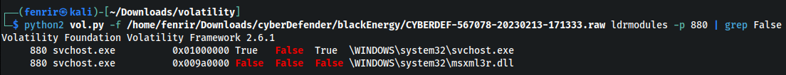

# Write Up BlackEnergy Blue Team Challenge
we can download this challenge on this link: https://download.cyberdefenders.org/BlueYard/c79-BE.zip

## Question 1
Which volatility profile would be best for this machine? 

## Answer 1
To find out the volatility profile for this machine, we can use the imageinfo plugin. For the command as follows:     

```
python2 vol.py -f [path_file] imageinfo
```

For the output such as this: <br>


The Answer is `WinXPSP2x86`

## Question 2
How many processes were running when the image was acquired?

## Answer 2
To find many processes were running when the image was acquired, we can use plugin pslist. pslist is a plugin that is used to display a list of processes (process list) from the analyzed memory. Here is the command:
```
python2 vol.py -f [path_file] imageinfo
```

For the output such as this: <br>


After all processes are displayed, look for running processes that are not exited. The Answer is `19`

## Question 3
What is the process ID of cmd.exe?

## Answer 3
For know process ID of cmd.exe, we can check with command pslist and search the PID of cmd.exe. This is PID of cmd.exe:


The answer is `1960`.

## Question 4
What is the name of the most suspicious process?

## Answer 4
We can also get suspicious process with plugin pslist. The suspicious is `rootkit.exe`. The name `rootkit.exe` is often associated with malicious software designed to give attackers privileged access to a computer system without the user's knowledge or consent. And check again with plugin pstree.

For the output such as this: <br>


This notice the process is child from `explorer.exe`. The answer is `rootkit.exe`.

## Question 5
Which process shows the highest likelihood of code injection?

## Answer 5
To find process shows the highest likelihood we can use `malfind` plugin. this plugin can help in detecting and isolating malicious code hidden in running system processes. This plugin attempts to find and display memory addresses where such malicious code may exist. Here is the command:

```
python2 vol.py -f [path_file] malfind
```

For the output such as this: <br>


And the name of process is `svchost.exe` with pid `880`. 

## Question 6
There is an odd file referenced in the recent process. Provide the full path of that file.

## Answer 6
The question ask full path of the file. we can use `handles` plugin to search odd file referenced in the recent process. Be using this plugin, we can view the list of handles currently in use by processes, including information about the object type, handle number, the process ID that owns the handle, and the description or name of the related object. Here is the command:

```
python2 vol.py -f [path_file] handles -p 880 -t file
```

we analys pid 880 and type handle is file. and this is output: <br>


The file "str.sys" is not a known system file in Windows. Therefore, it is possible that this file may be associated with malware or other malicious activity.

The answer is `C:\WINDOWS\system32\drivers\str.sys`.

## Question 7
What is the name of the injected dll file loaded from the recent process?

## Answer 7
We can seacrh injected dll file with plugin `ldrmodules`. This plugin can be used to display a list of all the loaded modules in a process's virtual address space, along with their base address, size, and name. This information can be useful in identifying potential malware or suspicious activity, as well as understanding the behavior of a system or application. Here is the command:

```
python2 vol.py -f [path_file] ldrmodules
```

But, there is too many output. Lets filter with pid 880. and the output such as this: <br>


Okay, lets filter again with grep `false` to make it easy for analysis. This is the output: <br>


The answer is `msxml3r.dll`.

## Question 8
What is the base address of the injected dll?

## Answer 8
Process the injected dll is svchost.exe. and we found that process with `malfind` plugin. In that's output has information about the process such as base address. Here the screenshoot of information we reach: <br>


The answer is `0x980000`.


